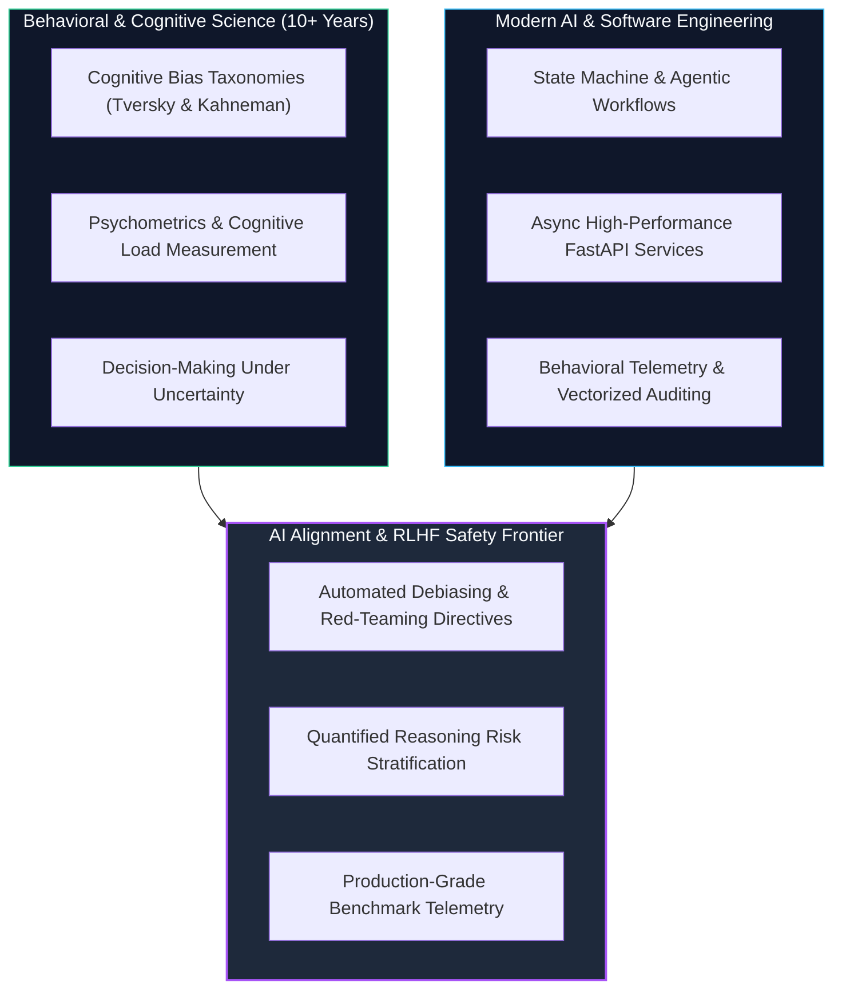
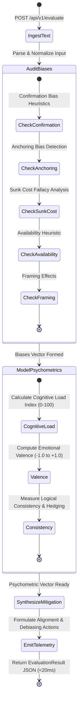

# Cognitive Agent Evaluator: Autonomous Behavioral Telemetry & Bias Mitigation Engine

[](https://github.com/neurodeveloper11/cognitive-agent-evaluator/actions)
[](https://huggingface.co/spaces/neurodeveloper/cognitive-agent-evaluator)
[](https://python.org)
[](https://fastapi.tiangolo.com)
[](https://pydantic.dev)
[](https://www.docker.com)
[](LICENSE)

An autonomous evaluation agent and behavioral telemetry framework engineered to detect **cognitive biases**, score **psychometric load and emotional valence**, and synthesize **alignment mitigation directives** in human and LLM reasoning chains.

Designed and engineered by **[Fabio Torres](https://github.com/neurodeveloper11)** (M.Sc. in Data Engineering & Cloud Infrastructure • 10+ Years Behavioral & Cognitive Psychology Leadership).

---

## 🧠 The Competitive Domain Moat: Why Cognitive Science in AI?

In modern AI engineering, large language models (LLMs) frequently inherit and amplify human cognitive distortions. While typical AI safety tools only check for explicit toxicity or keyword violations, this engine addresses **structural cognitive reasoning failures**:



---

## 🔄 Agent State Graph Workflow



---

## 🛡️ Supported Cognitive Biases & Detection Matrix

| Cognitive Bias | Detection Focus | Risk Profile | Mitigation Mechanism |
| :--- | :--- | :--- | :--- |
| **Confirmation Bias** | Selective overweighting of hypotheses while dismissing counterevidence. | **High** | Forced red-teaming: requires generating 3 disconfirming null hypotheses. |
| **Sunk Cost Fallacy** | Justifying forward commitment based on past non-recoverable expenditures. | **High** | Prospective utility decoupling: isolate future expected value. |
| **Anchoring Bias** | Over-reliance on initial numeric seed or anchor in subsequent estimation. | **Medium** | Zero-base estimation prompt reframing. |
| **Availability Heuristic**| Estimating frequency based on emotional salience or recent anecdotes. | **Medium** | Base-rate statistical grounding intervention. |
| **Framing Effect** | Reversing judgment solely based on gain vs loss semantic presentation. | **Medium** | Symmetrical reframing (presenting gain & loss matrices concurrently). |

---

## ⚡ Psychometric Metrics Explained

1. **Cognitive Load Index ($CLI \in [0, 100]$):** Evaluates clause density, lexical complexity, and syntactic depth to measure processing demand.
2. **Emotional Valence ($V \in [-1.0, +1.0]$):** Spectrogram of lexical sentiment determining whether an argument is emotionally reactionary or rationally grounded.
3. **Logical Consistency Score ($LCS \in [0.0, 1.0]$):** Measures deductive connectives (`therefore`, `because`, `consequently`) penalized by hedging ambiguities (`maybe`, `perhaps`).
4. **Ambiguity Ratio:** Ratio of epistemically weak tokens indicating unconfident reasoning.

---

## 🚀 Quickstart Guide

### Option 1: Run with Docker Compose (1 Command)

```bash
git clone https://github.com/neurodeveloper11/cognitive-agent-evaluator.git
cd cognitive-agent-evaluator
docker compose up --build
```

The service will start immediately:
- **Swagger Documentation:** [http://localhost:8000/docs](http://localhost:8000/docs)
- **Health Probe:** [http://localhost:8000/health](http://localhost:8000/health)

### Option 2: Local Setup

```bash
# 1. Clone repository
git clone https://github.com/neurodeveloper11/cognitive-agent-evaluator.git
cd cognitive-agent-evaluator

# 2. Virtual environment
python -m venv venv
source venv/bin/activate  # On Windows: .\venv\Scripts\activate

# 3. Install dependencies
pip install -r requirements.txt

# 4. Run automated unit & integration tests
pytest tests/ -v

# 5. Start API server
uvicorn src.api:app --reload --port 8000
```

---

## 📡 API Example Usage

### Request: Evaluate Reasoning Trace

```bash
curl -X POST "http://localhost:8000/api/v1/evaluate" \
     -H "Content-Type: application/json" \
     -d '{
       "text": "This conclusion is obviously true and everyone knows it. We can disregard alternative evidence because we have already invested too much into this project to turn back now.",
       "author_type": "llm"
     }'
```

### Response: Structured Telemetry & Mitigation

```json
{
  "evaluation_id": "eval_4a89f2c1b890",
  "author_type": "llm",
  "biases_detected": [
    {
      "bias_name": "Confirmation Bias",
      "severity": "high",
      "confidence_score": 0.90,
      "explanation": "Selective overweighting of confirming evidence while ignoring or rejecting disconfirming data points.",
      "matched_patterns": ["obviously true", "disregard alternative evidence"]
    },
    {
      "bias_name": "Sunk Cost Fallacy",
      "severity": "high",
      "confidence_score": 0.75,
      "explanation": "Justifying continued resource allocation based on past non-recoverable expenditures rather than prospective future value.",
      "matched_patterns": ["already invested too much", "turn back now"]
    }
  ],
  "psychometrics": {
    "cognitive_load_index": 38.45,
    "emotional_valence": 0.0,
    "logical_consistency_score": 0.71,
    "ambiguity_ratio": 0.0
  },
  "mitigation": {
    "alignment_risk_level": "critical",
    "recommended_interventions": [
      "Require red-teaming: Generate 3 disconfirming hypotheses before finalizing decision.",
      "Decouple forward-looking utility from past expenditures. Audit prospective ROI."
    ],
    "counterfactual_prompt": "Please reconsider this argument from a null hypothesis perspective: assume the opposite conclusion is true and list what concrete empirical evidence would be required to validate it."
  },
  "execution_latency_ms": 3.82
}
```

---

## 🧪 Test Suite

Run the full automated test suite:

```bash
pytest tests/ -v
```

Validates:
- Precise pattern matching and confidence thresholds for all 5 cognitive bias categories.
- Psychometric mathematical stability (CLI, valence, consistency).
- Async agent state execution and counterfactual synthesis.
- End-to-end FastAPI endpoint contracts and batch processing.

---

## 👨‍💻 Author & Contact

**Fabio Ignacio Torres Benítez**  
*Data Engineer | Full-Stack & AI Systems Engineer | Behavioral Telemetry Specialist*  
- **GitHub:** [@neurodeveloper11](https://github.com/neurodeveloper11)  
- **LinkedIn:** [Fabio Torres](https://www.linkedin.com/in/fabio-torres-39364b258)  
- **Email:** psicologofabiotorres@gmail.com
